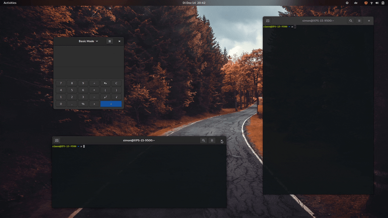

<p align="center">
  
</p>

# Set your Windows on Fire!

<a href="https://github.com/Schneegans/Burn-My-Windows/actions"></a>
<a href="LICENSE"></a>
<a href="https://extensions.gnome.org/extension/4679/burn-my-windows/"></a>

When I released the [Desktop Cube Extension](https://github.com/Schneegans/Desktop-Cube/), many people requested to revive one of the most useless features of Linux desktop history: Setting windows on fire!
This extension is not only more useless than the cube, but it is also much more hacky. So I expect some bug! [Let's incinerate them all](https://github.com/Schneegans/Burn-My-Windows/issues)!


## Installation

You can either install the Burn-My-Windows extension from extensions.gnome.org (a), download a stable release
from GitHub (b) or clone the latest version directly with `git` (c).

### a) Installing from extensions.gnome.org

This is the easiest way to install the Burn-My-Windows extension. Just head over to
[extensions.gnome.org](https://extensions.gnome.org/extension/4679/burn-my-windows/) and flip the switch!
If you want to use a more up-to-date version, you can try one of the methods listed below.

### b) Downloading a Stable Release

Execute this command to download the latest stable release:

```bash
wget https://github.com/Schneegans/Burn-My-Windows/releases/latest/download/burn-my-windows@schneegans.github.com.zip
```

Install it by executing the following command. If you have the Burn-My-Windows extension already installed and want to upgrade to
the latest version, append the `--force` flag in order to overwrite existing installs of the Burn-My-Windows extension.

```bash
gnome-extensions install burn-my-windows@schneegans.github.com.zip
```

Then restart GNOME Shell with <kbd>Alt</kbd> + <kbd>F2</kbd>, <kbd>r</kbd> + <kbd>Enter</kbd>.
Or logout / login if you are on Wayland.
Then you can enable the extension with the *Gnome Tweak Tool*, the *Extensions* application or with this command:

```bash
gnome-extensions enable burn-my-windows@schneegans.github.com
```

### c) Cloning the Latest Version with `git`

You should **not** clone the Burn-My-Windows extension directly to the `~/.local/share/gnome-shell/extensions` directory as this may get overridden occasionally!
Execute the clone command below where you want to have the source code of the extension.

```bash
git clone https://github.com/Schneegans/Burn-My-Windows.git
cd Burn-My-Windows
```

Now you will have to install the extension.
The `make` command below compiles the locales, schemas and resources, creates a zip file of the extension and finally installs it with the `gnome-extensions` tool.

```bash
make install
```

Then restart GNOME Shell with <kbd>Alt</kbd> + <kbd>F2</kbd>, <kbd>r</kbd> + <kbd>Enter</kbd>.
Or logout / login if you are on Wayland.
Then you can enable the extension with the *Gnome Tweak Tool*, the *Extensions* application or with this command:

```bash
gnome-extensions enable burn-my-windows@schneegans.github.com
```

## :octocat: I want to contribute!

That's great!
Here are some basic rulles to get you started:
Commits should start with a Capital letter and should be written in present tense (e.g. __:tada: Add cool new feature__ instead of __:tada: Added cool new feature__).
You should also start your commit message with **one** applicable emoji.
This does not only look great but also makes you rethink what to add to a commit. Make many but small commits!

Emoji | Description
------|------------
:tada: `:tada:` | When you added a cool new feature.
:wrench: `:wrench:` | When you added a piece of code.
:recycle: `:recycle:` | When you refactored a part of the code.
:sparkles: `:sparkles:` | When you applied clang-format.
:globe_with_meridians: `:globe_with_meridians:` | When you worked on translations.
:art: `:art:` | When you improved / added assets like themes.
:lipstick: `:lipstick:` | When you worked on the UI of the preferences dialog.
:rocket: `:rocket:` | When you improved performance.
:memo: `:memo:` | When you wrote documentation.
:beetle: `:beetle:` | When you fixed a bug.
:revolving_hearts: `:revolving_hearts:` | When a new sponsor is added or credits are updated.
:heavy_check_mark: `:heavy_check_mark:` | When you worked on checks or adjusted the code to be compliant with them.
:twisted_rightwards_arrows: `:twisted_rightwards_arrows:` | When you merged a branch.
:fire: `:fire:` | When you removed something.
:truck: `:truck:` | When you moved / renamed something.