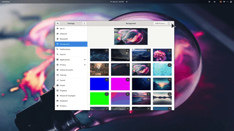
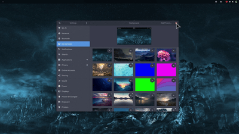
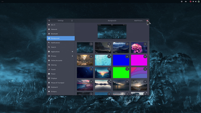

<p align="center">
  <a href="https://www.youtube.com/watch?v=L2aaNF_rPHo"></a>
</p>

<h1 align="center">🔥 Set GNOME Shell on Fire!</h1>
<p align="center">(and KWin as well)</p>

<p align="center">
<a href="https://extensions.gnome.org/extension/4679/burn-my-windows/"></a><br/>
<a href="https://github.com/Schneegans/Burn-My-Windows/actions"></a>
<a href="LICENSE"></a>
<a href="https://hosted.weblate.org/engage/burn-my-windows/"></a>
<a href="scripts/cloc.sh"></a>
<a href="scripts/cloc.sh"></a>
</p>

When I released the [Desktop Cube Extension](https://github.com/Schneegans/Desktop-Cube/) for GNOME, many people requested to revive one of the most useless features of Linux desktop history: Setting windows on fire!
This extension is not only more useless than the cube, but it is also much more hacky. So I expect some bug! [Let's incinerate them all](https://github.com/Schneegans/Burn-My-Windows/issues)!

Burn-My-Windows is not only available for **GNOME** but also includes some basic support for **KDE Plasma's KWin**.
Further down in this file you'll find installation instructions for both.

Effect | Preview
-----|--------
**Apparition** <br> This effect hides your windows by violently sucking them into the void of magic! | 
**Broken Glass** <br> Shatter your windows into a shower sharp shards! This effect can be configured so that the shards fly away from your mouse pointer position!| 
**Doom** <br> Melt your windows. Inspired by the legendary screen transitions of the original Doom. | 
**Energize A** <br> Beam your windows away! | 
**Energize B** <br> Using different transporter technology results in an alternative visual effect. | 
**Fire** <br> The classic effect inspired by Compiz. However, this is implemented using a GLSL shader and not with a particle system like in the old days. | 
**Hexagon** <br> With glowing lines and hexagon-shaped tiles, this effect looks very sci-fi. | 
**Incinerate** <br> A less snappy but definitely more fancy take on the fire effect. | 
**Matrix** <br> Turn your windows into a shower of green letters! The color is actually configurable.| 
**Pixelate** <br> Pixelate your windows and randomly hide pixels until the entire window is gone.| 
**Pixel Wheel** <br> This simple effect pixelates the window and hides the pixels in a wheel-like fashion.| 
**Pixel Wipe** <br> This effect pixelates the window and hides the pixels radially, starting from the pointer position.| 
**Snap of Disintegration** <br> Dissolve your windows into a cloud of dust.| 
**T-Rex Attack** <br> Destroy your windows with a series of violent slashes!| 
**TV-Effect** <br> This is a very simple effect to demonstrate that this extension could also be used in a more professional environment. | 
**Wisps** <br> Let your windows be carried away to the realm of dreams by these little fairies! | 
**Your Effect!** <br> The extension is very modular and with a bit of creativity and GLSL knowledge, [you can easily create your own effects](docs/how-to-create-new-effects.md). | [](docs/how-to-create-new-effects.md)

## ✅ Supported Versions

Not every effect is available on each version of GNOME or KWin.
Below is a table which summarizes the current availability for all effects.

<table width="100%">
<tr>
<td></td>
<td colspan="5"><strong>GNOME</strong></td>
<td colspan="1"><strong>KWin</strong></td>
</tr>
<tr><td></td>                        <td>3.36</td><td>3.38</td><td>40</td><td>41</td><td>42</td><td>5.25.0</td></tr>
<tr><td>Apparition</td>              <td>  </td>   <td>✅</td>  <td>✅</td><td>✅</td><td>✅</td><td>  </td>   </tr>
<tr><td>Broken Glass</td>            <td>  </td>   <td>  </td>  <td>✅</td><td>✅</td><td>✅</td><td>  </td>   </tr>
<tr><td>Doom</td>                    <td>  </td>   <td>✅</td>  <td>✅</td><td>✅</td><td>✅</td><td>✅</td>   </tr>
<tr><td>Energize A</td>              <td>✅</td>   <td>✅</td>  <td>✅</td><td>✅</td><td>✅</td><td>✅</td>   </tr>
<tr><td>Energize B</td>              <td>✅</td>   <td>✅</td>  <td>✅</td><td>✅</td><td>✅</td><td>✅</td>   </tr>
<tr><td>Fire</td>                    <td>✅</td>   <td>✅</td>  <td>✅</td><td>✅</td><td>✅</td><td>✅</td>   </tr>
<tr><td>Hexagon</td>                 <td>✅</td>   <td>✅</td>  <td>✅</td><td>✅</td><td>✅</td><td>✅</td>   </tr>
<tr><td>Incinerate</td>              <td>✅</td>   <td>✅</td>  <td>✅</td><td>✅</td><td>✅</td><td>✅</td>   </tr>
<tr><td>Matrix</td>                  <td>  </td>   <td>  </td>  <td>✅</td><td>✅</td><td>✅</td><td>  </td>   </tr>
<tr><td>Pixelate</td>                <td>✅</td>   <td>✅</td>  <td>✅</td><td>✅</td><td>✅</td><td>✅</td>   </tr>
<tr><td>Pixel Wheel</td>             <td>✅</td>   <td>✅</td>  <td>✅</td><td>✅</td><td>✅</td><td>✅</td>   </tr>
<tr><td>Pixel Wipe</td>              <td>✅</td>   <td>✅</td>  <td>✅</td><td>✅</td><td>✅</td><td>✅</td>   </tr>
<tr><td>Snap of Disintegration</td>  <td>  </td>   <td>  </td>  <td>✅</td><td>✅</td><td>✅</td><td>  </td>   </tr>
<tr><td>T-Rex Attack</td>            <td>  </td>   <td>  </td>  <td>✅</td><td>✅</td><td>✅</td><td>  </td>   </tr>
<tr><td>TV-Effect</td>               <td>✅</td>   <td>✅</td>  <td>✅</td><td>✅</td><td>✅</td><td>✅</td>   </tr>
<tr><td>Wisps</td>                   <td>✅</td>   <td>✅</td>  <td>✅</td><td>✅</td><td>✅</td><td>✅</td>   </tr>
</table>


## 💞 These People _love_ this Extension

While [coding new features](docs/how-to-create-new-effects.md) or [translating the extension](https://hosted.weblate.org/engage/burn-my-windows/) are the most awesome ways to contribute, providing financial support will help me stay motivated to invest my spare time to keep the project alive in the future.

<h3 align="center">🥇 Current Gold Sponsors</h3>
<p align="center">
  <a href="https://github.com/D3vil0per">D3vil0per</a><br>
  Maxence Sebald<br>
  <a href="https://github.com/dennis1248">Dennis ten Hoove</a><br>
</p>

<h3 align="center">🥈 Current Silver Sponsors</h3>
<p align="center">
  <a href="https://github.com/danielheadbang">@danielheadbang</a><br>
  <a href="https://github.com/MRR-dev">@MRR-dev</a><br>
  <a href="https://github.com/castrojo">Jorge Castro</a><br>
</p>

<h3 align="center">🥉 Current Bronze Sponsors</h3>
<p align="center">
  <a href="https://github.com/sponsors/Schneegans">Become the first!</a><br>
</p>

<h3 align="center">🏅 Previous Sponsors and One-Time Donators</h3>
<p align="center">
  <a href="https://twitter.com/tjiiik">tj3k</a><br>
  <a href='https://github.com/AngelBrielez'>Angel Brielez</a><br>
  <a href="https://github.com/wolfyrion">@wolfyrion</a><br>
  <a href="https://github.com/MrTomRod">@MrTomRod</a><br>
  Pouhiou<br>
  DAPREMONT Christophe<br>
  <a href="https://github.com/manero6">@manero6</a><br>
  <a href="https://github.com/RickStanley">@RickStanley</a><br>
</p>


Do you want to show that you love it too? You may <a href="https://github.com/sponsors/Schneegans">become a sponsor for as little as 1$ / month</a>!
If you like this extension, you may also want to try one of my other GNOME extensions: [🧊 Desktop-Cube](https://github.com/Schneegans/Desktop-Cube) or [🍰 Fly-Pie](https://github.com/Schneegans/Fly-Pie/)!

## ⬇️ Installation (GNOME)

You can either install the Burn-My-Windows extension from extensions.gnome.org (a), download a stable release
from GitHub (b) or clone the latest version directly with `git` (c).

### a) Installing from extensions.gnome.org

This is the easiest way to install the Burn-My-Windows extension. Just head over to
[extensions.gnome.org](https://extensions.gnome.org/extension/4679/burn-my-windows/) and flip the switch!
If you want to use a more up-to-date version, you can try one of the methods listed below.

### b) Downloading a Stable Release

Execute this command to download the latest stable release:

```bash
wget https://github.com/Schneegans/Burn-My-Windows/releases/latest/download/burn-my-windows@schneegans.github.com.zip
```

Install it by executing the following command. If you have the Burn-My-Windows extension already installed and want to upgrade to
the latest version, append the `--force` flag in order to overwrite existing installs of the Burn-My-Windows extension.

```bash
gnome-extensions install burn-my-windows@schneegans.github.com.zip
```

Then restart GNOME Shell with <kbd>Alt</kbd> + <kbd>F2</kbd>, <kbd>r</kbd> + <kbd>Enter</kbd>.
Or logout / login if you are on Wayland.
Then you can enable the extension with the *Gnome Tweak Tool*, the *Extensions* application or with this command:

```bash
gnome-extensions enable burn-my-windows@schneegans.github.com
```

### c) Cloning the Latest Version with `git`

You should **not** clone the Burn-My-Windows extension directly to the `~/.local/share/gnome-shell/extensions` directory as this may get overridden occasionally!
Execute the clone command below where you want to have the source code of the extension.

```bash
git clone https://github.com/Schneegans/Burn-My-Windows.git
cd Burn-My-Windows
```

Now you will have to install the extension.
The `make` command below compiles the locales, schemas and resources, creates a zip file of the extension and finally installs it with the `gnome-extensions` tool.

```bash
make install
```

Then restart GNOME Shell with <kbd>Alt</kbd> + <kbd>F2</kbd>, <kbd>r</kbd> + <kbd>Enter</kbd>.
Or logout / login if you are on Wayland.
Then you can enable the extension with the *Gnome Tweak Tool*, the *Extensions* application or with this command:

```bash
gnome-extensions enable burn-my-windows@schneegans.github.com
```


## ⬇️ Installation (KWin)

You can either download the effects from the KDE store (a), download a stable version from GitHub (b) or clone the latest version directly with `git` (c).

### a) Download from the [KDE Store](https://store.kde.org/p/1861183)

You can directly get the effects from within your system settings. Just go to your System Settings, then "Workspace Behavior", and "Desktop Effects". Then click on "Get new Desktop Effetcs...".

### b) Downloading a Stable Release

Execute this command to download the latest stable release:

```bash
wget https://github.com/Schneegans/Burn-My-Windows/releases/latest/download/burn_my_windows_kwin4.tar.gz
```

Install it by executing the following commands.

```bash
mkdir -p ~/.local/share/kwin/effects
tar -xf burn_my_windows_kwin4.tar.gz -C ~/.local/share/kwin/effects
```

Then select the desired effects in the system settings under "Desktop Effects".


### c) Cloning the Latest Version with `git`

Execute the clone command below where you want to have the source code of the extension.

```bash
git clone https://github.com/Schneegans/Burn-My-Windows.git
cd Burn-My-Windows
```

Now you will have to build the effects and copy them to your KWin effect directory.

```bash
./kwin/build.sh
mkdir -p ~/.local/share/kwin/effects
tar -xf kwin/burn_my_windows_kwin4.tar.gz -C ~/.local/share/kwin/effects
```

That's it!
You can now select the desired effects in the system settings under "Desktop Effects".


## :octocat: I want to contribute!

That's great!
Most likely, you want to [create a new effect](docs/how-to-create-new-effects.md) or to  [translate the extension](https://hosted.weblate.org/engage/burn-my-windows/)?
Here are some basic rules to get you started:
Commits should start with a Capital letter and should be written in present tense (e.g. __:tada: Add cool new feature__ instead of __:tada: Added cool new feature__).
You should also start your commit message with **one** applicable emoji.
This does not only look great but also makes you rethink what to add to a commit. Make many but small commits!

Emoji | Description
------|------------
:tada: `:tada:` | When you added a cool new feature.
:wrench: `:wrench:` | When you added a piece of code.
:recycle: `:recycle:` | When you refactored a part of the code.
:sparkles: `:sparkles:` | When you applied clang-format.
:globe_with_meridians: `:globe_with_meridians:` | When you worked on translations.
:art: `:art:` | When you improved / added assets like themes.
:lipstick: `:lipstick:` | When you worked on the UI of the preferences dialog.
:rocket: `:rocket:` | When you improved performance.
:memo: `:memo:` | When you wrote documentation.
:beetle: `:beetle:` | When you fixed a bug.
:revolving_hearts: `:revolving_hearts:` | When a new sponsor is added or credits are updated.
:heavy_check_mark: `:heavy_check_mark:` | When you worked on checks or adjusted the code to be compliant with them.
:twisted_rightwards_arrows: `:twisted_rightwards_arrows:` | When you merged a branch.
:fire: `:fire:` | When you removed something.
:truck: `:truck:` | When you moved / renamed something.