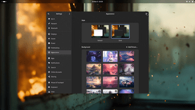

<!--
SPDX-FileCopyrightText: Simon Schneegans <code@simonschneegans.de>
SPDX-License-Identifier: CC-BY-4.0
-->

<p align="center">
  <a href="https://www.youtube.com/watch?v=ZHMboQq8Z5c"></a>
</p>

<h1 align="center">🔥 Set GNOME Shell and KWin on Fire!</h1>

<p align="center">
<a href="https://extensions.gnome.org/extension/4679/burn-my-windows/"></a><br/>
<a href="https://github.com/Schneegans/Burn-My-Windows/actions"></a>
<a href="https://api.reuse.software/info/github.com/Schneegans/Burn-My-Windows"></a>
<a href="https://schneegans.github.io/sponsors/"></a>
<a href="https://hosted.weblate.org/engage/burn-my-windows/"></a>
<a href="scripts/cloc.sh"></a>
<a href="scripts/cloc.sh"></a>
</p>

> [!IMPORTANT]
> The code in the `main` branch is for GNOME Shell 45+. For older GNOME versions, please use the `gnome-3.36-44` branch.

When I released the [Desktop Cube Extension](https://github.com/Schneegans/Desktop-Cube/) for GNOME, many people requested to revive one of the most useless features of Linux desktop history: Setting windows on fire!
This extension is not only more useless than the cube, but it is also much more hacky. So I expect some bug! [Let's incinerate them all](https://github.com/Schneegans/Burn-My-Windows/issues)!

**🖼️ The wallpapers used in the previews below were all generated using AI and are available in [this GitHub repository](https://github.com/Schneegans/ai-wallpapers).**

| Effect                                                                                                                                                                            | Preview                                                                               |
| --------------------------------------------------------------------------------------------------------------------------------------------------------------------------------- | ------------------------------------------------------------------------------------- |
| **Apparition** <br> This effect hides your windows by violently sucking them into the void of magic!                                                                              |                                                |
| **Broken Glass** <br> Shatter your windows into a shower sharp shards! This effect can be configured so that the shards fly away from your mouse pointer position!                |                                              |
| **Doom** <br> Melt your windows. Inspired by the legendary screen transitions of the original Doom.                                                                               |                                                      |
| **Energize A** <br> Beam your windows away!                                                                                                                                       |                                                |
| **Energize B** <br> Using different transporter technology results in an alternative visual effect.                                                                               |                                                |
| **Fire** <br> The classic effect inspired by Compiz. However, this is implemented using a GLSL shader and not with a particle system like in the old days.                        |                                                      |
| **Focus** <br> Focus dude, focus!                                                                                                                                                 |                                                     |
| **Glide** <br> This very simple effect fades the window to transparency with subtle 3D effects.                                                                                   |                                                     |
| **Glitch** <br> This effect applies some intentional graphics issues to your windows.                                                                                             |                                                    |
| **Hexagon** <br> With glowing lines and hexagon-shaped tiles, this effect looks very sci-fi.                                                                                      |                                                   |
| **Incinerate** <br> A less snappy but definitely more fancy take on the fire effect.                                                                                              |                                                |
| **Matrix** <br> Turn your windows into a shower of green letters! The color is actually configurable.                                                                             |                                                    |
| **Paint Brush** <br> Paint or erase your windows with a thick paint brush.                                                                                                        |                                               |
| **Pixelate** <br> Pixelate your windows and randomly hide pixels until the entire window is gone.                                                                                 |                                                  |
| **Pixel Wheel** <br> This simple effect pixelates the window and hides the pixels in a wheel-like fashion.                                                                        |                                               |
| **Pixel Wipe** <br> This effect pixelates the window and hides the pixels radially, starting from the pointer position.                                                           |                                                |
| **Portal** <br> This ridiculous effect teleports your windows from and to alternative dimensions. It may resemble the portal from a well-known cartoon series...                  |                                                    |
| **Snap of Disintegration** <br> Dissolve your windows into a cloud of dust.                                                                                                       |                                                      |
| **T-Rex Attack** <br> Destroy your windows with a series of violent slashes!                                                                                                      |                                                      |
| **TV Effect** <br> This is a very simple effect to demonstrate that this extension could also be used in a more professional environment.                                         |                                                        |
| **TV Glitch** <br> This effect combines the Glitch and the TV Effect.                                                                                                             |                                                 |
| **Wisps** <br> Let your windows be carried away to the realm of dreams by these little fairies!                                                                                   |                                                     |
| **Your Effect!** <br> The extension is very modular and with a bit of creativity and GLSL knowledge, [you can easily create your own effects](docs/how-to-create-new-effects.md). | [](docs/how-to-create-new-effects.md) |

## ✅ Supported Versions

Not every effect is available on each version of GNOME or KWin.
Below is a table which summarizes the current availability for all effects.

<table width="100%">
<tr>
<td></td>
<td colspan="3"><strong>GNOME</strong></td>
<td colspan="1"><strong>KWin</strong></td>
</tr>
<tr><td></td>                        <td>3.36</td> <td>3.38</td><td>40+</td><td>5.25.0+</td></tr>
<tr><td>Apparition</td>              <td>  </td>   <td>✅</td>  <td>✅</td> <td>  </td>   </tr>
<tr><td>Broken Glass</td>            <td>  </td>   <td>  </td>  <td>✅</td> <td>  </td>   </tr>
<tr><td>Doom</td>                    <td>  </td>   <td>✅</td>  <td>✅</td> <td>✅</td>   </tr>
<tr><td>Energize A</td>              <td>✅</td>   <td>✅</td>  <td>✅</td> <td>✅</td>   </tr>
<tr><td>Energize B</td>              <td>✅</td>   <td>✅</td>  <td>✅</td> <td>✅</td>   </tr>
<tr><td>Fire</td>                    <td>✅</td>   <td>✅</td>  <td>✅</td> <td>✅</td>   </tr>
<tr><td>Focus</td>                   <td>✅</td>   <td>✅</td>  <td>✅</td> <td>✅</td>   </tr>
<tr><td>Glide</td>                   <td>✅</td>   <td>✅</td>  <td>✅</td> <td>✅</td>   </tr>
<tr><td>Glitch</td>                  <td>✅</td>   <td>✅</td>  <td>✅</td> <td>✅</td>   </tr>
<tr><td>Hexagon</td>                 <td>✅</td>   <td>✅</td>  <td>✅</td> <td>✅</td>   </tr>
<tr><td>Incinerate</td>              <td>✅</td>   <td>✅</td>  <td>✅</td> <td>✅</td>   </tr>
<tr><td>Matrix</td>                  <td>  </td>   <td>  </td>  <td>✅</td> <td>  </td>   </tr>
<tr><td>Paint Brush</td>             <td>  </td>   <td>  </td>  <td>✅</td> <td>  </td>   </tr>
<tr><td>Pixelate</td>                <td>✅</td>   <td>✅</td>  <td>✅</td> <td>✅</td>   </tr>
<tr><td>Pixel Wheel</td>             <td>✅</td>   <td>✅</td>  <td>✅</td> <td>✅</td>   </tr>
<tr><td>Pixel Wipe</td>              <td>✅</td>   <td>✅</td>  <td>✅</td> <td>✅</td>   </tr>
<tr><td>Portal</td>                  <td>✅</td>   <td>✅</td>  <td>✅</td> <td>✅</td>   </tr>
<tr><td>Snap of Disintegration</td>  <td>  </td>   <td>  </td>  <td>✅</td> <td>  </td>   </tr>
<tr><td>T-Rex Attack</td>            <td>  </td>   <td>  </td>  <td>✅</td> <td>  </td>   </tr>
<tr><td>TV Effect</td>               <td>✅</td>   <td>✅</td>  <td>✅</td> <td>✅</td>   </tr>
<tr><td>TV Glitch</td>               <td>✅</td>   <td>✅</td>  <td>✅</td> <td>✅</td>   </tr>
<tr><td>Wisps</td>                   <td>✅</td>   <td>✅</td>  <td>✅</td> <td>✅</td>   </tr>
</table>

## 💞 Show that you love Burn-My-Windows!

[](https://ko-fi.com/schneegans)
[](https://github.com/sponsors/Schneegans)
[](https://www.paypal.com/donate/?hosted_button_id=3F7UFL8KLVPXE)
[](https://schneegans.cb.id)

While coding new features or translating Burn-My-Windows is the most awesome way to contribute, providing financial support will encourage me to invest my spare time for developing free and open-source software.

**These awesome people have already donated to the development of my open-source projects:**

<a href="https://schneegans.github.io/sponsors/">
  <picture>
    <source media="(prefers-color-scheme: dark)" srcset="https://schneegans.github.io/sponsors/sponsors_dark_small.svg">
    
  </picture>
</a>

## ⬇️ Installation (GNOME)

You can either install the Burn-My-Windows extension from extensions.gnome.org (a), download a stable release
from GitHub (b) or clone the latest version directly with `git` (c).

### a) Installing from extensions.gnome.org

This is the easiest way to install the Burn-My-Windows extension. Just head over to
[extensions.gnome.org](https://extensions.gnome.org/extension/4679/burn-my-windows/) and flip the switch!
If you want to use a more up-to-date version, you can try one of the methods listed below.

### b) Downloading a Stable Release

Execute this command to download the latest stable release:

```bash
wget https://github.com/Schneegans/Burn-My-Windows/releases/latest/download/burn-my-windows@schneegans.github.com.zip
```

Install it by executing the following command. If you have the Burn-My-Windows extension already installed and want to upgrade to
the latest version, append the `--force` flag in order to overwrite existing installs of the Burn-My-Windows extension.

```bash
gnome-extensions install burn-my-windows@schneegans.github.com.zip
```

Then restart GNOME Shell with <kbd>Alt</kbd> + <kbd>F2</kbd>, <kbd>r</kbd> + <kbd>Enter</kbd>.
Or logout / login if you are on Wayland.
Then you can enable the extension with the _Gnome Tweak Tool_, the _Extensions_ application or with this command:

```bash
gnome-extensions enable burn-my-windows@schneegans.github.com
```

### c) Cloning the Latest Version with `git`

You should **not** clone the Burn-My-Windows extension directly to the `~/.local/share/gnome-shell/extensions` directory as this may get overridden occasionally!
Execute the clone command below where you want to have the source code of the extension.

```bash
git clone https://github.com/Schneegans/Burn-My-Windows.git
cd Burn-My-Windows
```

If your GNOME Shell version is <= 45, you will have to checkout the `gnome-3.36-44` branch:

```bash
git checkout gnome-3.36-44
```

Now you will have to install the extension.
The `make` command below compiles the locales, schemas and resources, creates a zip file of the extension and finally installs it with the `gnome-extensions` tool.

```bash
make install
```

Then restart GNOME Shell with <kbd>Alt</kbd> + <kbd>F2</kbd>, <kbd>r</kbd> + <kbd>Enter</kbd>.
Or logout / login if you are on Wayland.
Then you can enable the extension with the _Gnome Tweak Tool_, the _Extensions_ application or with this command:

```bash
gnome-extensions enable burn-my-windows@schneegans.github.com
```

## ⬇️ Installation (KWin)

You can either download the effects from the KDE store (a), download a stable version from GitHub (b) or clone the latest version directly with `git` (c).

> [!IMPORTANT]
> You need at least KWin 5.25.0 for the Burn-My-Windows effects.

> [!NOTE]
> If the color picker widgets in the effect settings do not work for you, you may have to install a package called `libkf5widgetsaddons-dev` (Kubuntu, KDE Neon, ...) or `kf5-kwidgetsaddons-devel`, `kwidgetsaddons-devel` (Fedora, OpenSuse, ...).

### a) Download from the KDE Store

Here are links to all effects which are currently available in the KDE store:

| Plasma 5                                       | Plasma 6                                       |
| ---------------------------------------------- | ---------------------------------------------- |
| [Doom](https://store.kde.org/p/1898739)        | [Doom](https://store.kde.org/p/2133831)        |
| [Energize A](https://store.kde.org/p/1884310)  | [Energize A](https://store.kde.org/p/2133829)  |
| [Energize B](https://store.kde.org/p/1884311)  | [Energize B](https://store.kde.org/p/2133828)  |
| [Fire](https://store.kde.org/p/1884307)        | [Fire](https://store.kde.org/p/2133822)        |
| [Focus](https://store.kde.org/p/2221217)       | [Focus](https://store.kde.org/p/2221219)       |
| [Glide](https://store.kde.org/p/1935778)       | [Glide](https://store.kde.org/p/2133839)       |
| [Glitch](https://store.kde.org/p/1972813)      | [Glitch](https://store.kde.org/p/2133844)      |
| [Hexagon](https://store.kde.org/p/1884309)     | [Hexagon](https://store.kde.org/p/2133836)     |
| [Incinerate](https://store.kde.org/p/1861183)  | [Incinerate](https://store.kde.org/p/2133817)  |
| [Pixelate](https://store.kde.org/p/1898742)    | [Pixelate](https://store.kde.org/p/2133832)    |
| [Pixel Wheel](https://store.kde.org/p/1898746) | [Pixel Wheel](https://store.kde.org/p/2133833) |
| [Pixel Wipe](https://store.kde.org/p/1898748)  | [Pixel Wipe](https://store.kde.org/p/2133834)  |
| [Portal](https://store.kde.org/p/1959879)      | [Portal](https://store.kde.org/p/2133842)      |
| [TV-Effect](https://store.kde.org/p/1884312)   | [TV-Effect](https://store.kde.org/p/2133825)   |
| [TV-Glitch](https://store.kde.org/p/1982142)   | [TV-Glitch](https://store.kde.org/p/2133819)   |
| [Wisps](https://store.kde.org/p/1884313)       | [Wisps](https://store.kde.org/p/2133824)       |

You can also directly get the effects from within your system settings.
Just go to your System Settings, then "Workspace Behavior", and "Desktop Effects". Then click on "Get new Desktop Effects...".

### b) Downloading a Stable Release

Execute this command to download the latest stable release:

```bash
# For Plasma 5
wget https://github.com/Schneegans/Burn-My-Windows/releases/latest/download/burn_my_windows_kwin5.tar.gz

# For Plasma 6
wget https://github.com/Schneegans/Burn-My-Windows/releases/latest/download/burn_my_windows_kwin6.tar.gz
```

Install it by executing the following commands.

```bash
mkdir -p ~/.local/share/kwin/effects

# For Plasma 5
tar -xf burn_my_windows_kwin5.tar.gz -C ~/.local/share/kwin/effects

# For Plasma 6
tar -xf burn_my_windows_kwin6.tar.gz -C ~/.local/share/kwin/effects
```

Then select the desired effects in the system settings under "Desktop Effects".

### c) Cloning the Latest Version with `git`

Execute the clone command below where you want to have the source code of the extension.

```bash
git clone https://github.com/Schneegans/Burn-My-Windows.git
cd Burn-My-Windows
```

Now you will have to build the effects and copy them to your KWin effect directory.

```bash
./kwin/build.sh
mkdir -p ~/.local/share/kwin/effects

# For Plasma 5
tar -xf kwin/burn_my_windows_kwin5.tar.gz -C ~/.local/share/kwin/effects

# For Plasma 6
tar -xf kwin/burn_my_windows_kwin6.tar.gz -C ~/.local/share/kwin/effects
```

That's it!
You can now select the desired effects in the system settings under "Desktop Effects".

## :octocat: I want to contribute!

That's great!
Most likely, you want to [create a new effect](docs/how-to-create-new-effects.md) or to [translate the extension](https://hosted.weblate.org/engage/burn-my-windows/)?
Here are some basic rules to get you started:
Commits should start with a Capital letter and should be written in present tense (e.g. **:tada: Add cool new feature** instead of **:tada: Added cool new feature**).
You should also start your commit message with **one** applicable emoji.
This does not only look great but also makes you rethink what to add to a commit. Make many but small commits!

| Emoji                                                     | Description                                                               |
| --------------------------------------------------------- | ------------------------------------------------------------------------- |
| :tada: `:tada:`                                           | When you added a cool new feature.                                        |
| :wrench: `:wrench:`                                       | When you added a piece of code.                                           |
| :recycle: `:recycle:`                                     | When you refactored a part of the code.                                   |
| :sparkles: `:sparkles:`                                   | When you applied clang-format.                                            |
| :globe_with_meridians: `:globe_with_meridians:`           | When you worked on translations.                                          |
| :art: `:art:`                                             | When you improved / added assets like themes.                             |
| :lipstick: `:lipstick:`                                   | When you worked on the UI of the preferences dialog.                      |
| :rocket: `:rocket:`                                       | When you improved performance.                                            |
| :memo: `:memo:`                                           | When you wrote documentation.                                             |
| :beetle: `:beetle:`                                       | When you fixed a bug.                                                     |
| :revolving_hearts: `:revolving_hearts:`                   | When a new sponsor is added or credits are updated.                       |
| :heavy_check_mark: `:heavy_check_mark:`                   | When you worked on checks or adjusted the code to be compliant with them. |
| :twisted_rightwards_arrows: `:twisted_rightwards_arrows:` | When you merged a branch.                                                 |
| :fire: `:fire:`                                           | When you removed something.                                               |
| :truck: `:truck:`                                         | When you moved / renamed something.                                       |
