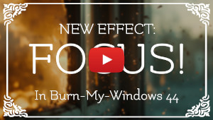
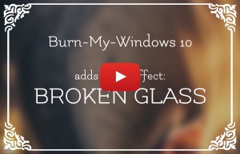

<!--
SPDX-FileCopyrightText: Simon Schneegans <code@simonschneegans.de>
SPDX-License-Identifier: CC-BY-4.0
-->

# Changelog of the Burn-My-Windows Extension

## [Burn My Windows 44](https://github.com/schneegans/Burn-My-Windows/releases/tag/v44)

**Release Date:** 2024-11-06

#### New Features

- **New Effect: Focus.** Focus dude, focus. This effect is available both for GNOME and KDE. Thanks to [@jgarza9788](https://github.com/jgarza9788) for this contribution!
- Effect Search: There is now a search bar in the preferences dialog which allows you to quickly find the effect you are looking for. Thanks to [@jgarza9788](https://github.com/jgarza9788) for this contribution!

#### Other Changes

- The animation duration of all effects can now be adjusted between 0.1s and 3s. This makes fine adjustments easier than with the previous 0.1s to 10s range.
- There are now different effect packages for Plasma 5 and Plasma 6. Please make sure to install the correct one for your system.
- Many translations have been updated. Thanks to all the translators!
- The CI jobs now run only on X11. In addition to GNOME 45, they now also run on GNOME 46 and GNOME 47.

#### Bug Fixes

- The effects now work on Plasma 6 even if an ICC profile is set. Thanks to [@Zamundaaa](https://github.com/Zamundaaa) for helping here!

## [Burn My Windows 43](https://github.com/schneegans/Burn-My-Windows/releases/tag/v43)

**Release Date:** 2024-08-23

#### Enhancements

- Ported the extension to GNOME 47.
- Several translations have been updated. Thanks to all the translators!

#### Bug Fixes

- Fixed an issue in the KDE metadata files which caused a warning in the logs on KDE Plasma 6. Thanks to [@nask0](https://github.com/nask0) for the fix!

## [Burn My Windows 42 [backport release]](https://github.com/schneegans/Burn-My-Windows/releases/tag/v42)

**Release Date:** 2024-02-27

- Ported the changes from Burn-My-Windows 41 to GNOME 3.36 - 44.

## [Burn My Windows 41](https://github.com/schneegans/Burn-My-Windows/releases/tag/v41)

**Release Date:** 2024-02-27

#### Enhancements

- The extension has been updated to work with GNOME 46.
- Several translations have been updated. Thanks to all the translators!
- All CI jobs are now executed for GNOME 45 and GNOME 46 as well.

#### Bug Fixes

- Fixed a compatibility issue with Plasma 6. Thanks to [@CoelacanthusHex](https://github.com/CoelacanthusHex) for the fix!
- Fixed an issue which caused the origin of the Incinerate and Pixel Wipe effects to be reset to the current mouse position whenever another effect was started while an effect was still running.

## [Burn My Windows 40 [backport release]](https://github.com/schneegans/Burn-My-Windows/releases/tag/v40)

**Release Date:** 2023-10-26

#### Enhancements

- Ported the changes from Burn-My-Windows 39 to GNOME 3.36 - 44.

## [Burn My Windows 39](https://github.com/schneegans/Burn-My-Windows/releases/tag/v39)

**Release Date:** 2023-10-26

#### Enhancements

- On KDE, the effects are no longer applied to windows which are on all desktops and have no decoration. This is primarily meant to avoid applying the effects to the Alt+Tab switcher.
- Several translations have been updated. Thanks to all the translators!
- Instead of an always out-of-date list of sponsors, the main menu of the preferences dialog now contains a link to the new [list of all donors](https://schneegans.github.io/sponsors/). This list is semi-automatically updated whenever a new donation is received. Thanks to all the donors!
- The possibility to [donate cryptocurrencies](https://schneegans.cb.id) has been added.

#### Bug Fixes

- Fixed an issue which caused overly large windows on GNOME for certain applications (e.g. KPatience) if they were re-opened after being closed in maximized state.
- Fixed an issue with the archive format which caused a failure when installing the effects via KDE Discover.

## [Burn My Windows 38](https://github.com/schneegans/Burn-My-Windows/releases/tag/v38)

**Release Date:** 2023-09-09

#### Major Changes

- This is the first release of Burn-My-Windows supporting GNOME 45. This required a [major refactoring](https://github.com/Schneegans/Burn-My-Windows/pull/373/files) of the code base as GJS now uses ESM modules. As a consequence, this version is not compatible with older versions of GNOME Shell anymore. The old code base is still available on the `gnome-3.36-44` branch and if new features are added (especially translations), they can be backported to this branch.

## [Burn My Windows 37](https://github.com/schneegans/Burn-My-Windows/releases/tag/v37)

**Release Date:** 2023-08-26

#### Bug Fixes

- Fixed an issue which caused the effects to crash on KDE in some cases.

#### Enhancements

- Several translations have been updated. Thanks to all the translators!

## [Burn My Windows 36](https://github.com/schneegans/Burn-My-Windows/releases/tag/v36)

**Release Date:** 2023-08-18

#### New Features

- Two convenience buttons have been added to the preferences dialog. One allows you to select all effects, the other one allows you to deselect all effects.
- A new main menu entry has been added which allows you to open the effect-profile directory. This is useful if you want to back up or share your profiles with others.
- The Wisps effect now supports colorful wisps. You can now specify three colors for the effect. These colors make up a gradient which is used to color the wisps.

#### Enhancements

- Several translations have been updated. Thanks to all the translators!

#### Bug Fixes

- Some effects (Fire, Incinerate, Energize A, Energize B) are faded towards the edges of the window. This used to look weird when the window is maximized. This has been fixed.
- On KDE, the animations are not applied to IntelliJ IDEs anymore. These IDEs use windows for their tooltips which do not set the WM class correctly. This caused the animations to be applied to the tooltips as well making them unusable. This is rather a workaround than a fix, but makes the effect usable again in conjunction with IntelliJ IDEs.

## [Burn My Windows 35](https://github.com/schneegans/Burn-My-Windows/releases/tag/v35)

**Release Date:** 2023-07-03

#### New Features

- **New Effect: Paint-Brush.** This effect paints or erases your windows with a thick paint brush.

## [Burn My Windows 34](https://github.com/schneegans/Burn-My-Windows/releases/tag/v34)

**Release Date:** 2023-09-06

#### Enhancements

- Added support for the new donation button on extensions.gnome.org.
- https://www.paypal.me/simonschneegans is now the default donation link for PayPal.

## [Burn My Windows 33](https://github.com/schneegans/Burn-My-Windows/releases/tag/v33)

**Release Date:** 2023-06-06

#### Enhancements

- When opening the preferences, a dialog is now shown occasionally to kindly ask for a donation. The dialog can be disabled once it has been shown for the first time.
- Several translations have been updated. Thanks to all the translators!

#### Bug Fixes

- Fixed an issue on GNOME 44.2 which caused the effects to look broken. It was caused by [this change](https://gitlab.gnome.org/GNOME/gnome-shell/-/merge_requests/2650).
- Fixed an issue which prevented the settings of the Snap of Disintegration effect from being translatable.

## [Burn My Windows 32](https://github.com/schneegans/Burn-My-Windows/releases/tag/v32)

**Release Date:** 2023-05-22

#### Enhancements

- Several translations have been updated. Thanks to all the translators!

#### Bug Fixes

- Fixed an issue which caused corrupted windows on X11 GNOME 44 under very specific circumstances. This happened only on X11 and only when the window was resized before it was actually shown.

## [Burn My Windows 31](https://github.com/schneegans/Burn-My-Windows/releases/tag/v31)

**Release Date:** 2023-05-04

#### Enhancements

- Several translations have been updated. Thanks to all the translators!

#### Bug Fixes

- Fixed an issue which made windows invisible which did not set the `WM_CLASS` X11 property correctly.
- Fixed an issue which made window-picking of Wayland windows impossible on GNOME 44.

## [Burn My Windows 30](https://github.com/schneegans/Burn-My-Windows/releases/tag/v30)

**Release Date:** 2023-04-08

#### Bug Fixes

- Fixed yet another incompatibility with the [Compiz alike magic lamp effect](https://extensions.gnome.org/extension/3740/compiz-alike-magic-lamp-effect/).

## [Burn My Windows 29](https://github.com/schneegans/Burn-My-Windows/releases/tag/v29)

**Release Date:** 2023-04-08

#### Bug Fixes

- Fixed a regression which caused window-close animations not to shown in front of full-screen windows.
- Fixed an incompatibility with the [Compiz alike magic lamp effect](https://extensions.gnome.org/extension/3740/compiz-alike-magic-lamp-effect/).

## [Burn My Windows 28](https://github.com/schneegans/Burn-My-Windows/releases/tag/v28)

**Release Date:** 2023-04-06

#### Enhancements

- **New donation method: Ko-fi**. Follow me on Ko-fi to get the latest updates regarding my extensions: https://ko-fi.com/schneegans!
- All shaders are now compatible with OpenGL ES. Due to [this change in Mutter](https://gitlab.gnome.org/GNOME/mutter/-/merge_requests/2672) the number of devices using OpenGL ES has significantly increased since GNOME 44. This change makes Burn-My-Windows working on those devices.
- It is now possible to create effects which do not have any settings at all.

#### Bug Fixes

- [This change in GNOME Shell](https://gitlab.gnome.org/GNOME/gnome-shell/-/commit/7bd98f3f5fb7e0d1220646b8a4ee7073534a8e8f) prevented Burn-My-Windows from working if no hardware-acceleration was available on GNOME 44, including the Docker containers used for CI testing. Some severe refactoring was necessary to fix this issue.
- The tutorial on how to create new effects has been updated and should work again.
- Fixed an issue which caused effect-profile loading to fail whenever Burn-My-Windows was updated.

## [Burn My Windows 27](https://github.com/schneegans/Burn-My-Windows/releases/tag/v27)

**Release Date:** 2023-03-01

#### New Features

- **Effect Profiles:** It is now possible to create _effect profiles_. Each profile contains a different set of effect settings. You can choose for each profile under which circumstances it will be used. Currently, these constraints are supported:

  - Application name
  - Animation type (open close)
  - Window type (normal, dialog)
  - Desktop style (light, dark)
  - Power mode (plugged-in, on battery)
  - Power profile (power saver, balanced, performance)

  This allows for a very detailed configuration of the extension. For instance, you can now...

  - ... exclude specific applications from BMW effects
  - ... select effects per-application
  - ... use different configurations of the same effect for opening or closing windows

  The extension will attempt to migrate your previous settings to the new effect profile system. Depending on your previous configuration, you may have now one or two profiles to start with, but you can add an arbitrary amount of profiles.

  The effect profiles are available for all supported GNOME versions (that is GNOME 3.36, 3.38, 40, 41, 42, 43, and 44).

- **Wallpapers:** A set of AI-generated [wallpapers has released](https://github.com/Schneegans/ai-wallpapers). For each effect of Burn-My-Windows, there is one dedicated wallpaper. As a central theme, each wallpaper shows a window. In some cases, the window is actually burning!
- Initial support for GNOME 44.

#### Other Enhancements

- As part of the effect profile implementation, the libadwaita-inspired preferences dialog layout got back-ported to all other supported GNOME versions.
- A notification is now shown in the settings dialog whenever the extension got updated. It contains a link to this changelog.
- Many translation updates. Thanks to all the translators!

## [Burn My Windows 26](https://github.com/schneegans/Burn-My-Windows/releases/tag/v26)

**Release Date:** 2023-02-04

#### New Features

- **New Effect: TV-Glitch.** This effect combines the Glitch and the TV Effect into one. Credits go to [Kurt Wilson](https://github.com/Kurtoid) for this idea!

#### Other Enhancements

- On KDE, the effect configuration dialogs can now be translated. The translations for GNOME are re-used, so we already have many translations! This requires at least KWin 5.27 to be working.
- Many translation updates, including a completely new Japanese translation. Thanks to all the translators!
- The effect colors for the Glitch and TV Effect now support an alpha channel. With this you can control how much color gets mixed into the window color.

## [Burn My Windows 25](https://github.com/schneegans/Burn-My-Windows/releases/tag/v25)

**Release Date:** 2023-01-17

#### Bug Fixes

- Fixed an issue which prevented the extension from loading if `power-profiles-daemon` was masked.

## [Burn My Windows 24](https://github.com/schneegans/Burn-My-Windows/releases/tag/v24)

**Release Date:** 2023-01-14

#### New Features

- **New Effect: Glitch.** This effect applies some intentional graphics issues to your windows.
- There is a new option to disable the effects when power-save mode is active. This may not only help to reduce power consumption, but also help in situation where the window animation do not run fluently in power-save mode. This option requires the power-profiles daemon, so it should be available for GNOME Shell 41 and beyond.

#### Other Enhancements

- Many translation updates, including a completely new Indonesian translation. Thanks to all the translators!
- The menu button of the settings dialog has been moved to the left and now shows a heart instead of three dots.
- The about dialog now uses the `Adw.AboutWindow` if available.

#### Bug Fixes

- Fixed an issue which could lead to black artifacts for some effects (Fire, Incinerate, Matrix, Portal, T-Rex Attack, and Wisps).

## [Burn My Windows 23](https://github.com/schneegans/Burn-My-Windows/releases/tag/v23)

**Release Date:** 2022-12-23

#### New Features

- **New Effect: Portal.** This ridiculous effect teleports your windows from and to alternative dimensions. It may resemble the portal from a well-known cartoon series...

#### Other Enhancements

- Many translation updates. Thanks to all the translators!

## [Burn My Windows 22](https://github.com/schneegans/Burn-My-Windows/releases/tag/v22)

**Release Date:** 2022-11-09

#### New Features

- **New Effect: Glide.** A very subtle effect which simply fades the window and applies some 3D-like tilting and scaling. This effect is available on all support GNOME versions and on KDE.

#### Other Enhancements

- The settings dialog has been redesigned specifically for libadwaita. These changes are only available on GNOME 42 and GNOME 43.
- Many translation updates, including a completely new Romanian translation. Thanks to all the translators!
- The KWin port of Burn-My-Windows now uses `metadata.json` files instead of the deprecated `metadata.desktop` format.
- Burn-My-Windows now follows the [REUSE Specification](https://reuse.software/spec).

## [Burn My Windows 21](https://github.com/schneegans/Burn-My-Windows/releases/tag/v21)

**Release Date:** 2022-09-14

#### New Features

- Added support for GNOME 43.

#### Other Enhancements

- Several new translations have been added, including a Lithuanian, Ukrainian, Esperanto, Portuguese, Azerbaijani, and Hebrew translation. Also, many other translations received updates. Thanks to all the translators!

## [Burn My Windows 20](https://github.com/schneegans/Burn-My-Windows/releases/tag/v20)

**Release Date:** 2022-09-06

#### New Features

- **New Effect: Doom.** Melt your windows. Inspired by the legendary screen transitions of the original Doom.
- **New Effect: Pixelate.** Pixelate your windows and randomly hide pixels until the entire window is gone.
- **New Effect: Pixel Wheel.** This simple effect pixelates the window and hides the pixels in a wheel-like fashion.
- **New Effect: Pixel Wipe.** This effect pixelates the window and hides the pixels radially, starting from the pointer position.

#### Enhancements

- Under KWin, the effects now use the same names as in the KDE store.
- The continuous integration tests now use a fuzzy search for the images targets. This way, the test work again on X11 and Wayland.
- A new GitHub Actions workflow has been added which is executed whenever a commit message includes the `[generate-references]` tag. This workflow re-creates all reference images for the continuous integration test.

#### Bug Fixes

- Fixed a bug which caused the Incinerate Effect to sometimes not show up properly on KWin if the "Start at pointer position" option was enabled.

## [Burn My Windows 19](https://github.com/schneegans/Burn-My-Windows/releases/tag/v19)

**Release Date:** 2022-08-18

#### New Features

- The incinerate effect now uses the current mouse pointer position as starting position of the burn effect. The old random behaviour can be enabled in the settings. This works both on GNOME and KDE.

#### Enhancements

- Many translation updates, including a completely new Portuguese, Esperanto, and Hebrew translation. A BIG THANKS to all translators!
- On GNOME, effects can now execute code whenever an animation ended. This is useful for cleaning up resources.
- The KWin build script now generates a separate archive for each effect as well as a combined archive for all effects.

#### Fixes

- Fixed the effect configuration dialog of the Fire effect on KDE.

## [Burn My Windows 18](https://github.com/schneegans/Burn-My-Windows/releases/tag/v18)

**Release Date:** 2022-06-30

#### Fixes

- The GNOME extension package now does not include the KWin JavaScript files anymore.

## [Burn My Windows 17](https://github.com/schneegans/Burn-My-Windows/releases/tag/v17)

**Release Date:** 2022-06-30

#### New Features

- **New Effect: Incinerate.** This is a completely new take on the fire effect. It is a bit more demanding in terms of GPU power, but at the same time it looks much more awesome!
- **Initial KDE Support.** Thanks to the [awesome work](https://invent.kde.org/plasma/kwin/-/merge_requests/2227) of Martin Flöser, it has become possible to port some of its effects to KDE Plasma! For now, only the most simple effects can be ported, but hopefully this list can be improved in the future.
- An option has been added which allows to automatically disable all effects if running on battery power.

#### Enhancements

- Many translation updates, including a completely new Persian, Polish, and Slovak translation. A BIG THANKS to all translators!
- The shader include system has been simplified. There's now just one "common.glsl" which is automatically loaded into each shader.

## [Burn My Windows 16](https://github.com/schneegans/Burn-My-Windows/releases/tag/v16)

**Release Date:** 2022-05-21

#### Enhancements

- Many translation updates, including a completely new Arabic, Finnish, Korean, and Swedish translation. A BIG THANKS to all translators!
- The shaders are now aware of the actual window size (e.g. excluding the area where the shadow is drawn). For instance, this **fixes the drawing of the effects outside the window bounds** for `libadwaita` apps.
- Refactored how the size and opacity transitions of the window actors are set up. Effects can now only specify a desired actor scale which will not change during the animation. All dynamic scaling and fading must be implemented in the shaders now.
- The standard uniforms of all shaders have been updated: The window size is now passed as a `vec2` and there is a new `bool uForOpening` which is set to `true` if a window-open animation is ongoing, to `false` otherwise.

#### Bug Fixes

- **Fixed a major memory leak**. Now, shaders are not re-created anymore whenever a window is opened or closed. Instead, previously created shaders are re-used as often as possible. This requires that all settings are set as uniform values (previously they were injected into the shader source) which in turn requires that `Shell.GLSLEffect` is used instead of `Clutter.ShaderEffect`. This change also requires that all shaders now work with straight instead of premultiplied alpha. Anyways, a lot needed to be refactored for this fix and I hope that it did not bring too many visual changes.
- Fixed the window-close animation of windows which were opened before the session was started (e.g. before GNOME Shell has been restarted).
- There seem to be cases were `libadwaita` is not available on GNOME 42 (e.g. Pop!\_OS 22.04 beta). The preferences dialog now tries to fallback to the GTK4-only variant if `libadwaita` is not available.

## [Burn My Windows 15](https://github.com/schneegans/Burn-My-Windows/releases/tag/v15)

**Release Date:** 2022-04-06

#### New Features

- **New Effect: Apparition.** This effect hides the window by violently sucking it into the void of magic. This is available only for GNOME Shell 3.38 and newer.
- **New Effect: Hexagon.** With glowing lines and hexagon-shaped tiles, this effect looks very sci-fi. This is available for GNOME Shell 3.36 and newer.
- **New Effect: Snap of Disintegration.** This was requested quite frequently! Dissolve your windows into a cloud of dust. This is available only for GNOME Shell 40 and newer.

#### Bug Fixes

- Disabled the buggy "Shatter from pointer" option of the Broken Glass effect when opening windows (it only makes sense for closing windows).

## [Burn My Windows 14](https://github.com/schneegans/Burn-My-Windows/releases/tag/v14)

**Release Date:** 2022-03-29

#### Enhancements

- Reduced the lower animation time limits for all effects to 100 ms. This should now allow for very snappy animations!
- A completely new Russian translation. Thank you, ANIGO R.!

#### Bug Fixes

- Fixed the version check for GNOME Shell `42.rc` (before it only worked on `42.alpha` and `42.beta`)

## [Burn My Windows 13](https://github.com/schneegans/Burn-My-Windows/releases/tag/v13)

**Release Date:** 2022-03-27

#### Enhancements

- The continuous integration tests have been significantly enhanced. Now, all window-open and window-close animations are visually tested on all supported GNOME versions and on X11 / Wayland (summing up to a total of 136 test cases).
- Many translation updates, including a completely new Turkish and Chinese translation. A BIG THANKS to all translators!

#### Other Changes

- Removed the Liberapay donation option as it does not work properly.

#### Bug Fixes

- Fixed the version check for GNOME Shell 42.

## [Burn My Windows 12](https://github.com/schneegans/Burn-My-Windows/releases/tag/v12)

**Release Date:** 2022-02-19

#### New Features

- Added initial support for GNOME Shell 42.
- The preferences dialog now uses libadwaita on GNOME Shell 42.

#### Enhancements

- Added [Liberapay](https://liberapay.com/Schneegans) to the sponsorship options.

## [Burn My Windows 11](https://github.com/schneegans/Burn-My-Windows/releases/tag/v11)

**Release Date:** 2022-02-03

#### New Features

- Added an about-dialog which shows all translators and sponsors.

#### Enhancements

- There are several new translations! Thanks a lot to all the translators! We now have translations for:
  - German
  - English
  - Czech
  - Dutch
  - French
  - Italian
  - Norwegian Bokmål
  - Spanish
- A new issue template for suggesting new effects has been added.

#### Fixes

- Fixed an issue which caused corrupted windows when trying to maximize windows while the window-open animation was still running (#82, #86, #91).

## [Burn My Windows 10](https://github.com/schneegans/Burn-My-Windows/releases/tag/v10)

**Release Date:** 2022-01-31

#### New Features

- **Effects for Window Opening.** You can now select effects which are applied on newly opened windows! I expect that there are some bugs left, so please [report any issue you find](https://github.com/Schneegans/Burn-My-Windows/issues)!
- **New Effect: Broken Glass.** Shatter your windows into a shower sharp shards! This effect can be configured so that the shards fly away from your mouse pointer position!
- **Preview Buttons** have been added to the effect-configuration pages of the preferences dialog. These can be used to, well, preview the current settings (without having to enable the effect first).
- **Translations!** It is now possible to [translate the preferences dialog](https://hosted.weblate.org/engage/burn-my-windows/). There is already a finished German translation, and in-progress translations to Italian and Norwegian Bokmål.
- **A "Vertical Overshooting" option** was added to the Matrix Effect: This can add some vertical variation to the start and end position of the letter drops.

#### Other Enhancements

- Added a menu entry with a link to the guide for creating new effect types.
- Thanks to improved timing, the default animation time of several effects could be reduced.
- The README now shows the current lines of code and the current comment percentage using my [dynamic-badges-action](https://github.com/Schneegans/dynamic-badges-action).
- **Add advanced CI tests:** For each commit to `main`, it is now tested whether the extension can be installed and if the preferences dialog can be shown on GNOME Shell 3.36, 3.38, 40, and 41. Both, X11 and Wayland are checked.

## [Burn My Windows 9](https://github.com/schneegans/Burn-My-Windows/releases/tag/v9)

**Release Date:** 2022-01-18

#### Fixes

- Improved compatibility with [Show Application View When Workspace Empty ](https://extensions.gnome.org/extension/2036/show-application-view-when-workspace-empty/) (#54).
- Fixed a crash which happened when the window-close icon in the overview was clicked twice (#49).

## [Burn My Windows 8](https://github.com/schneegans/Burn-My-Windows/releases/tag/v8)

**Release Date:** 2022-01-17

#### New Features

- **Random effects!** You can now select a set of effects of which one will be chosen randomly whenever you close a window. **This changes how effects are selected, so you will have to re-select your desired effect(s)**.
- **New Effect: Energize A.** Beam your windows away!
- **New Effect: Energize B.** Using different transporter technology results in an alternative visual effect.
- **New Effect: Wisps.** These little fairies carry your windows to the realm of dreams!
- Each effect has its own "Animation Time" setting now. The global animation time has been replaced by those, so **you may have to adjust the sliders to match your previous settings**.

#### Other Enhancements

- A [guide for creating new effects](how-to-create-new-effects.md) has been added.
- The source code has received a **major refactoring**. This will make the addition of new effects much easier in the future.
- The **layout of the settings dialog** has been reworked to make it easier to expand it in the future.
- The lower limit of the **animation time of the TV Effect** has been reduced.
- The T-Rex-Attack effect is not shown in fully transparent regions of a window any more.
- The shaders now use a different noise implementation which produces better 3D noise.

#### Fixes

- The extension now works even if GNOME Shell's animations are disabled globally.

## [Burn My Windows 7](https://github.com/schneegans/Burn-My-Windows/releases/tag/v7)

**Release Date:** 2022-01-03

#### New Features

- An option to use a 3D noise for the fire shader has been added. This will add some more temporal variation to the flames at the cost of slightly decreased rendering performance.
- A changelog entry has been added to the menu of the preferences dialog.

#### Fixes

- Resolve copyright issues by using a MIT-licensed noise implementation.

## [Burn My Windows 6](https://github.com/schneegans/Burn-My-Windows/releases/tag/v6)

**Release Date:** 2022-01-02

#### Fixes

- Removed a debug log message.

## [Burn My Windows 5](https://github.com/schneegans/Burn-My-Windows/releases/tag/v5)

**Release Date:** 2022-01-02

#### New Features

- Added a new ridiculous close-animation: the T-Rex-Attack!
- Added a new simple close-animation: the TV-Effect!
- Added a menu to the preferences dialog with links for bug reporting and donations.

#### Other Enhancements

- The fire shader now uses a `smoothstep` to make it less blocky.

#### Bug Fixes

- Fixed a bug which messed up the overview of GNOME Shell 3.36.

## [Burn My Windows 4](https://github.com/schneegans/Burn-My-Windows/releases/tag/v4)

**Release Date:** 2021-12-25

#### New Features

- Added a new Matrix shader which dissolves your windows in a shower of green letters. You can switch between the fire and the matrix shader in the settings. Sadly, this effect cannot be available under GNOME 3.3x as it was apparently impossible to set textures for a `Clutter.ShaderEffect` in GJS back then.
- Added a setting to apply the animation also for closing dialog windows.

#### Other Enhancements

- Refactored the code a lot to make it easier to add new shader effects in the future.
- Tweaked timing of the fire shader. Previously, the fire became invisible quite quickly. Due to this new animation timing, the default animation time has been reduced to 1500 ms.

## [Burn My Windows 3](https://github.com/schneegans/Burn-My-Windows/releases/tag/v3)

**Release Date:** 2021-12-20

#### New Features

- Add support for GNOME 3.36 and GNOME 3.38.

## [Burn My Windows 2](https://github.com/schneegans/Burn-My-Windows/releases/tag/v2)

**Release Date:** 2021-12-16

#### New Features

- Added the possibility to adjust fire colors.
- Added the possibility to adjust flame speed and scale.
- Added some fire presets.

## [Burn My Windows 1](https://github.com/schneegans/Burn-My-Windows/releases/tag/v1)

**Release Date:** 2021-12-14

- Initial publication on GitHub supporting GNOME 40 and GNOME 41.
